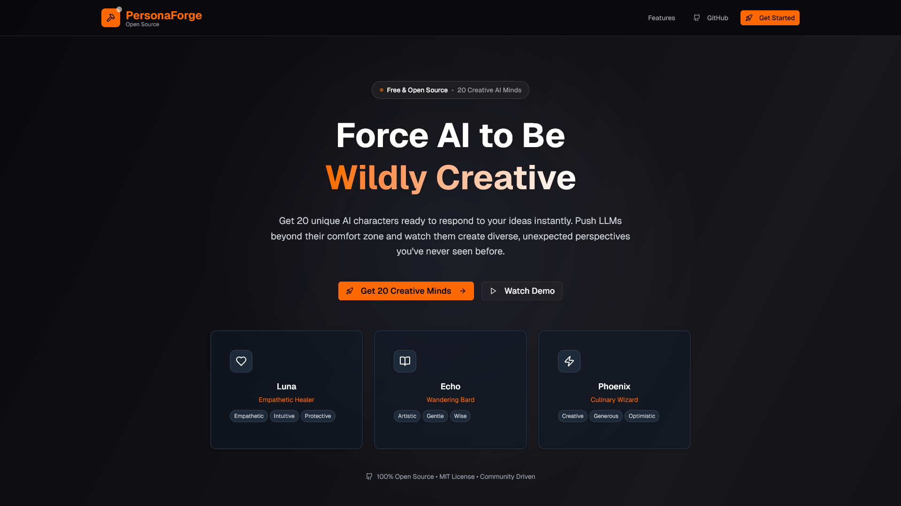

# PersonaForge



## Force AI to Be Wildly Creative

PersonaForge is an open-source application that pushes AI beyond generic responses by generating unique characters with distinct personalities, backgrounds, and perspectives. Instead of getting boring, predictable AI responses, you get 20 creative minds ready to tackle your ideas from completely different angles.

**Created by [@PanzerBread](https://x.com/PanzerBread) on X**

## What Does It Do?

- **🧠 Generate Unique AI Personas**: Each with distinct personalities, backgrounds, and creative perspectives
- **💬 Individual & Group Chat**: Chat with personas one-on-one or ask questions to all of them simultaneously
- **🎨 AI-Generated Avatars**: Each persona gets a unique visual representation
- **⚡ Real-Time Streaming**: Watch responses stream in as different minds tackle your ideas
- **🌙 Dark Mode Design**: Beautiful, modern UI optimized for dark themes
- **🔄 Dynamic Generation**: Create themed persona sets around any topic or concept

## How It Works

1. **Enter Your Idea**: Type anything - a question, problem, creative challenge, or wild concept
2. **Minds Respond**: Watch as unique AI characters with different personalities tackle your idea from every angle
3. **Get Amazed**: Discover perspectives you never considered, pushing AI beyond basic responses

## Required Environment Variables

To run PersonaForge, you need these 2 environment variables:

```bash
OPENROUTER_API_KEY=your_openrouter_api_key_here
OPENAI_API_KEY=your_openai_api_key_here
```

- **OPENROUTER_API_KEY**: For persona generation and chat functionality via Google AI Studio
- **OPENAI_API_KEY**: For generating unique avatars using DALL-E 2

## Quick Start

1. **Clone the repository**:

   ```bash
   git clone https://github.com/your-username/persona.git
   cd persona
   ```

2. **Install dependencies**:

   ```bash
   pnpm install
   ```

3. **Set up environment variables**:
   Create a `.env.local` file in the root directory:

   ```bash
   OPENROUTER_API_KEY=your_openrouter_api_key_here
   OPENAI_API_KEY=your_openai_api_key_here
   ```

4. **Build and run**:

   ```bash
   pnpm build
   pnpm start
   ```

5. **Open your browser**:
   Navigate to `http://localhost:3000`

## Features

### 🎭 Dynamic Persona Generation

- Generate themed personas around any topic
- Each persona has unique personality traits, backgrounds, and response styles
- Powered by Google AI Studio via OpenRouter

### 💬 Interactive Chat

- **Individual Chat**: Deep one-on-one conversations with specific personas
- **Group Chat**: Ask questions to all personas and compare their responses
- **Streaming Responses**: Real-time response streaming for immediate feedback

### 🎨 AI-Generated Avatars

- Automatically generated visual representations for each persona
- Powered by OpenAI's DALL-E 2 API
- Cached for performance optimization

### 🛠️ Developer Features

- **Development Caching**: Personas and avatars cached locally for 24 hours
- **Debug Tools**: Development panel for regenerating personas and clearing cache
- **Cost Optimization**: Smart caching reduces API costs during development

## Technology Stack

- **Frontend**: Next.js 15, React 19, TypeScript
- **Styling**: Tailwind CSS, shadcn/ui components
- **AI Integration**:
  - Google AI Studio via OpenRouter (persona generation & chat)
  - OpenAI DALL-E 2 (avatar generation)
- **Package Manager**: pnpm

## API Costs

- **Persona Generation**: ~$0.0004 for 20 personas (Google Gemini Flash 1.5)
- **Avatar Generation**: ~$0.064 for 20 avatars (DALL-E 2, 256x256)
- **Chat**: ~$0.00015 per 1K tokens (Google Gemini Flash 1.5)
- **Total First Load**: ~$0.065 for 20 personas with avatars

## Development vs Production

**Development Mode** (localhost):

- Personas and avatars cached locally for 24 hours
- Debug panel available
- Console logging enabled
- Minimized API calls

**Production Mode**:

- Fresh generation on each deployment
- No local caching
- Debug panel hidden
- Optimized for performance

## Contributing

PersonaForge is 100% open source and community-driven. We welcome contributions!

1. Fork the repository
2. Create your feature branch (`git checkout -b feature/amazing-feature`)
3. Commit your changes (`git commit -m 'Add some amazing feature'`)
4. Push to the branch (`git push origin feature/amazing-feature`)
5. Open a Pull Request

## License

This project is licensed under the MIT License - see the [LICENSE](LICENSE) file for details.

## Support

- **GitHub Issues**: Report bugs and request features
- **Community**: Join developers, AI enthusiasts, and creative minds
- **Creator**: Follow [@PanzerBread](https://x.com/PanzerBread) on X

---

**Stop settling for boring AI responses. Force AI into creative overdrive with PersonaForge.**
